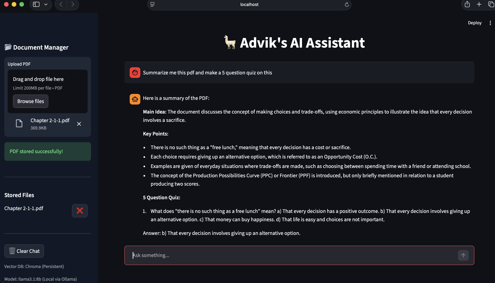
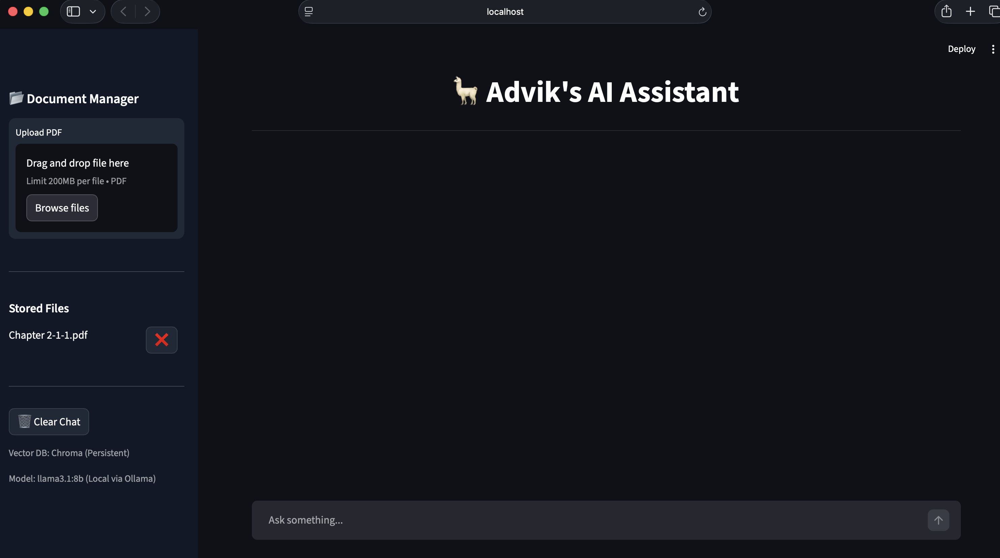

# 🦁Sheru - Advik's AI Assistant

> A local AI chatbot powered by **Llama 3.1 8B** and **ChromaDB**, with streaming responses, persistent RAG, and a sleek dark UI.

---

## 💡 Features

- 🌙 Permanent Dark Mode UI  
- 📂 Fixed sidebar PDF upload & file management  
- 💬 Chat history with **streaming typing effect**  
- 🧠 Contextual **RAG** with persistent Chroma vector DB  
- 🗑️ Delete & clear documents  
- 🖥️ Fully fixed **sticky header**  
- ⚡ Clean, SaaS-style layout

---

## 📸 Screenshots

**Chat Interface**

  
*Chat with Llama 3.1, streaming responses and sticky header.*

**File Upload & Management**

  
*Upload PDFs, view files, and delete unwanted documents.*

**Demo GIF (Optional)**

  
*Interactive chat demo showcasing RAG and streaming responses.*

---

## 🏗 Architecture Diagram
+———+      +———–+      +––––––––+
|  User   | —> | Streamlit | —> |  ChromaDB DB   |
+———+      +———–+      +––––––––+
|
v
+———–+
| Llama3.1 |
+———–+
|
v
Response

🧩 Usage
	•	Upload PDFs via the sidebar
	•	Ask questions in the chat input
	•	Responses are generated using Llama 3.1 with contextual knowledge from your uploaded documents
	•	Persistent ChromaDB ensures documents are remembered
	•	Delete unwanted documents anytime via the sidebar
	•	Clear the chat with the “🗑 Clear Chat” button

